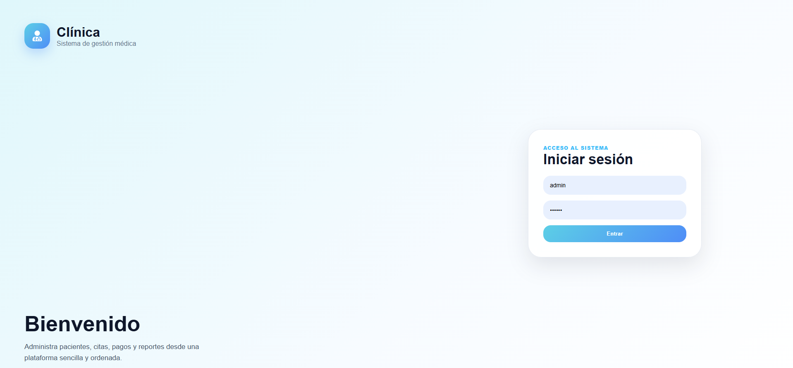
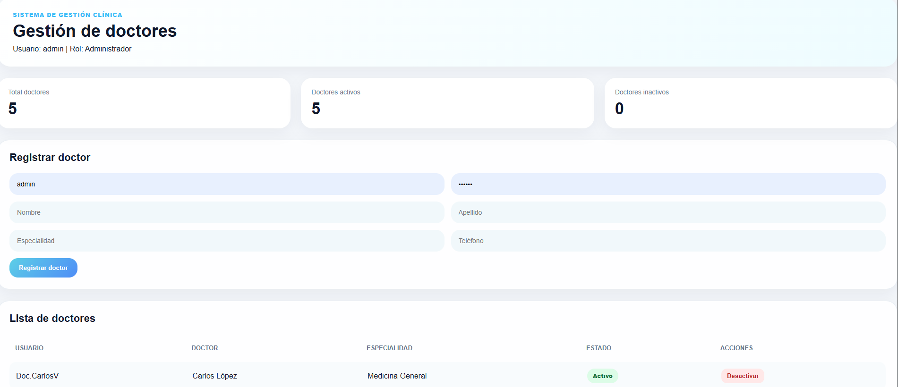
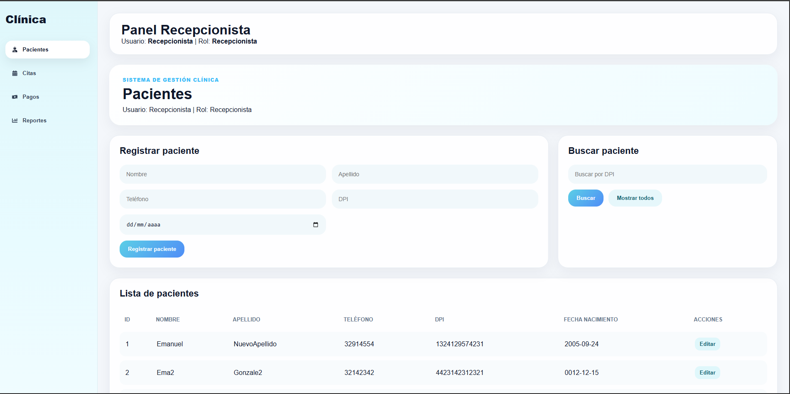
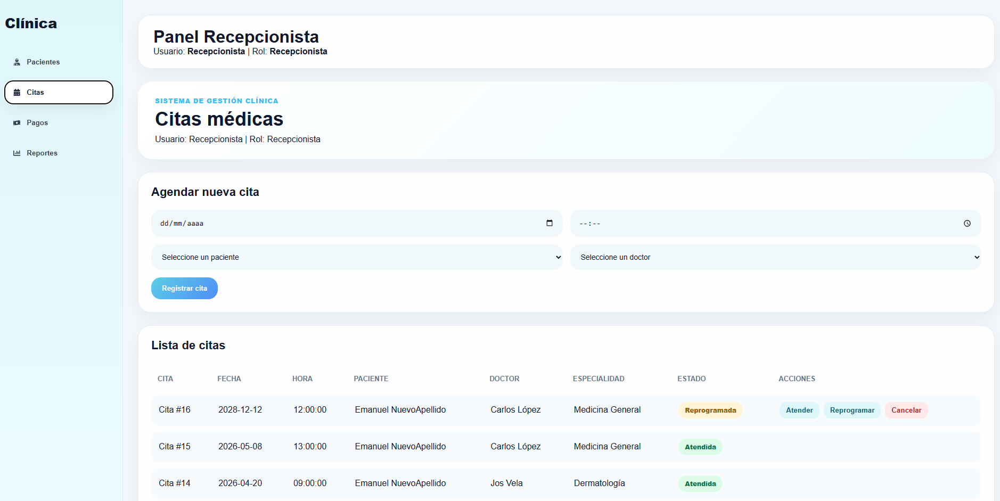
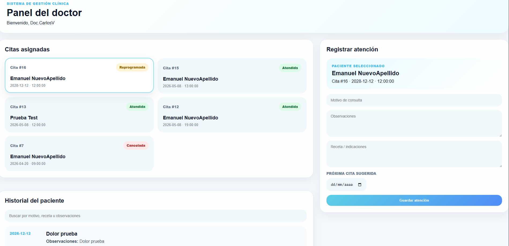
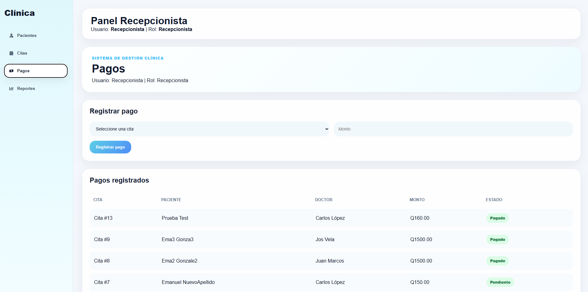
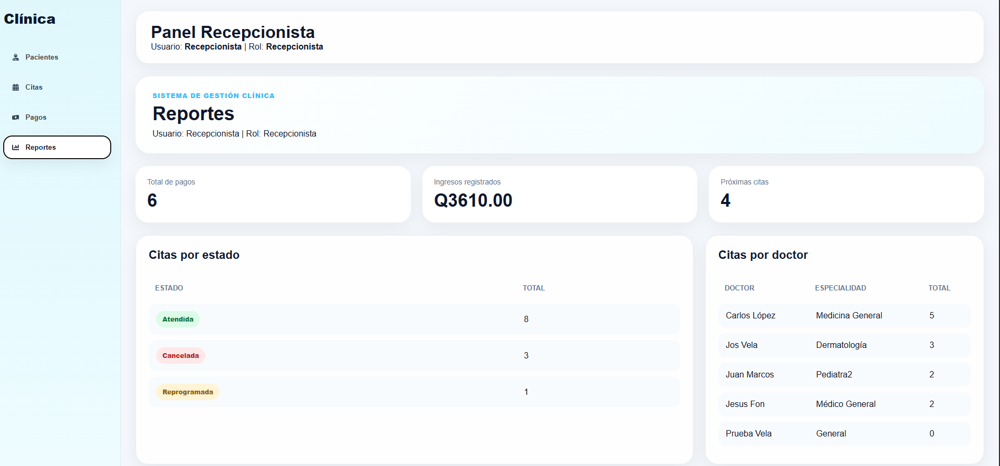

# Sistema de Gestión Clínica | Clinic Management System

Sistema web de gestión clínica desarrollado como proyecto académico utilizando arquitectura fullstack con React, Node.js, TypeScript y PostgreSQL.

Web-based clinic management system developed as an academic project using a fullstack architecture with React, Node.js, TypeScript, and PostgreSQL.

---

## Tecnologías utilizadas | Technologies Used


---

# Screenshots

## Login
<p align="center">
  
</p>

---

## Administración | Administration
<p align="center">
  
</p>

---

## Gestión de Pacientes | Patient Management
<p align="center">
  
</p>

---

## Gestión de Citas | Appointment Management
<p align="center">
  
</p>

---

## Panel del Doctor | Doctor Dashboard
<p align="center">
  
</p>

---

## Gestión de Pagos | Payment Management
<p align="center">
  
</p>

---

## Reportes | Reports
<p align="center">
  
</p>

---


## Características

- Autenticación de usuarios
- Gestión de pacientes
- Gestión de doctores
- Gestión de citas médicas
- Historial clínico
- Gestión de pagos
- Reportes básicos
- Roles de usuario
- API RESTful
- Arquitectura modular por capas

---

## Arquitectura del proyecto

```txt
clinicaFrontend/   → Frontend React
clinicaBackend/    → Backend Node.js + Express
```

---

## Funcionalidades principales

### Pacientes
- Registro de pacientes
- Actualización de información
- Búsqueda de pacientes

### Doctores
- Registro de doctores
- Activación y desactivación de doctores
- Vista de citas asignadas

### Citas
- Agendar citas
- Reprogramar citas
- Cancelar citas
- Consulta de citas

### Historial clínico
- Registro médico
- Consulta de historial clínico
- Recetas médicas

### Pagos
- Registro y control de pagos

---


## Features

- User authentication
- Patient management
- Doctor management
- Medical appointment management
- Medical history system
- Payment management
- Basic reports
- User roles and permissions
- RESTful API
- Layered modular architecture

---

## Project Architecture

```txt
clinicaFrontend/   → React Frontend
clinicaBackend/    → Node.js + Express Backend
```

---

## Main Functionalities

### Patients
- Patient registration
- Information update
- Patient search

### Doctors
- Doctor registration
- Doctor activation and deactivation
- Assigned appointments view

### Appointments
- Schedule appointments
- Reschedule appointments
- Cancel appointments
- Appointment management

### Medical History
- Medical records
- Medical history consultation
- Medical prescriptions

### Payments
- Payment registration and control

---

## Autor | Author

**Emanuel Gonzalez**